# llm-actuators

LLM-first toolchain — single-purpose binaries that let an LLM act on real systems (devices, processes, files, other agents).

The canonical entrypoint is [llms.txt](llms.txt). It is short and reads as well in a model's context as in a terminal.

This README exists so humans landing here have something to scan. Everything else in this repo is structured for model consumption.

## Architecture

The toolchain groups into layers. An **orchestrator** (`tctl`) turns a feature spec into test cases and drives the **device-control** bridges (`ddb` / `idb` / `wdb`) that share one verb set across Android, iOS, and web. On-device agents emit a **semantic-schema** payload that the **visual** tools (`vdb` / `fdb`) diff for design-vs-built drift. A **coordination** layer (`switchboard`, `recruit`) runs and supervises multi-agent sessions, while **session-management** (`token-monitor`, `compact-self`) and an **enforcement + harness** layer (`skill-router`, `workflows`, `substrate`, `claude-sandbox`) keep those sessions safe, governed, and reproducible.

## What lives here

This repo is the **entrypoint** to the [llm-actuators](https://github.com/llm-actuators) org. It indexes 15 binaries and libraries and hosts cross-cutting docs that don't belong in any single tool repo:

- The repo map and binary fleet ([repos.md](repos.md), [binaries.md](binaries.md))
- The common device-control surface across `ddb` / `idb` / `wdb` ([device-control.md](device-control.md))
- The in-app agent HTTP contract ([agent-contract.md](agent-contract.md))
- Walker accessibility surface — app-side obligations for finding elements ([walker-accessibility.md](walker-accessibility.md))
- Mock corpus envelope shape, overlays, and stateful mutations ([mock-corpus.md](mock-corpus.md))
- The shared schema overview ([schema.md](schema.md))
- Release/CHANGELOG/ADR conventions ([conventions.md](conventions.md))

## What does NOT live here

Per-tool documentation (READMEs, CHANGELOGs, ADRs) stays in each tool's own repo. This repo links to those rather than duplicating them. Deep operational state (tech-debt ledger, epics, prod-readiness) lives in [tctl/docs/](https://github.com/llm-actuators/tctl/tree/main/docs).
